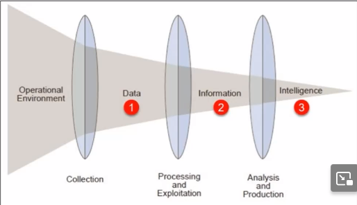
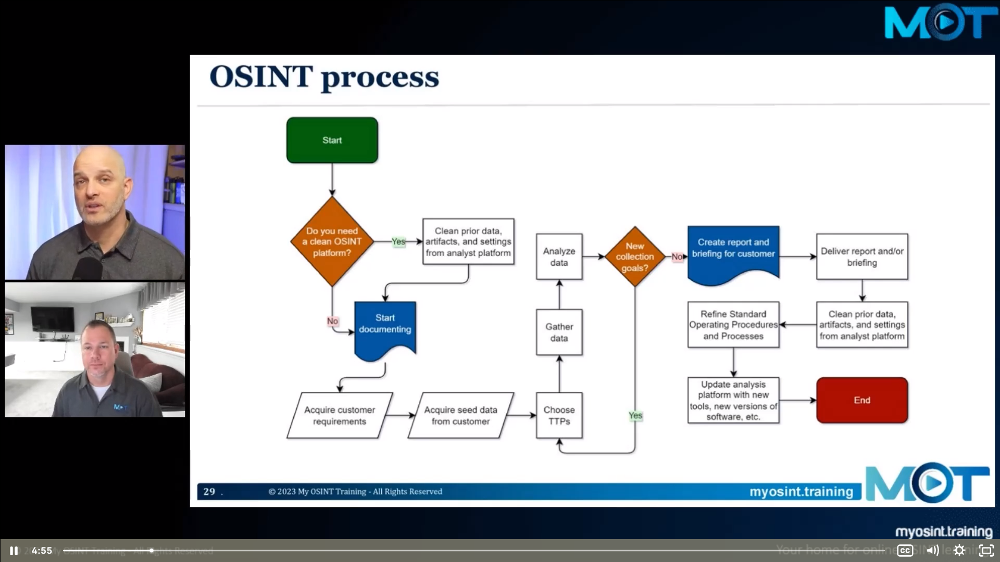
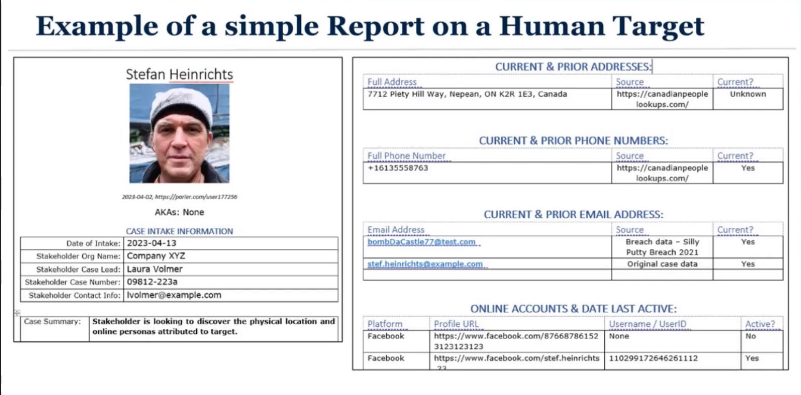
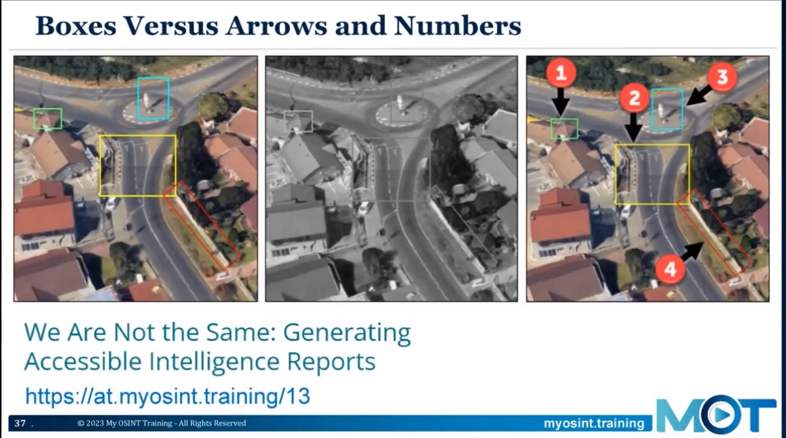

# Introduction
## What is OSINT?
OSINT - Open Source Intelligence 
Searching, collecting, and analyzing available data, and using it to answer question

## What do we collect?
- Images and Videos
- Text and Documents 
- TV and radio broadcasts
- Newspaper ..	

## Who uses OSINT tools and techniques? 
- Law Enforcement 
- Intelligence community
- Military 
- Business
- Cyber professional 
- Journalists
- Researchers 
- Criminals
- Everyday People

Think about
- Did you understand what to do? 
- Did you have the skills to find the answers to the questions?
- Was the time pressure helpful or did it hinder your performance?

Tips: Keep snapshot of the information
# Operational Security (OPSEC) and OSINT

Wy do you need to protect yourself and system?
- Decrease effectiveness of **eavesdropping** by companies, governments and people.
- Decrease possibility of retribution by target.
- Increase anonymization of your activities.
	- To your target(s)
	- On the platform(s)
	- To your Internet Provider
- Isolate malicious links/document 

Who or what are you trying to hide your activity from?
- Your target 
- Web Server Administrator
- Internet Service Provider (ISP)
- Internet trackers and advertisers
- Government 
OSINT Curious Blog Post by Nico Dekens: https://at.myosint.training/5a

## Protection
- About You
- About Your Network
- About Your Computer
- Who You Work For 
- What You are Doing

## Protecting: Your identity 
1. Use covert accounts/synthetic identities/sock puppets when possible, never personal account
2. Use third-party tools to passively collect data
3. Never re-use passwords or share your real personal data/interests in your fake accounts

## Protecting: Your Network
- Think about who/what you are hiding from
- Consider using cellular connections to the Internet 
- Use paid VPNs (Virtual Private Networks) for both encryption and changing location appearance 
- Virtualized cloud system and browser can be another buffer

## Protecting: Your computer and phone
- Use dedicated systems to perform OSINT work when possible 
- Use virtualization tools VirtualBox, VMware, Android Emulator
- Use anti-virus and anti-malware software
- Check software for privacy and security leaks including your mobile social media apps 

USASOC Identity Management Cards - https://myosint.link/opsec / https://web.archive.org/web/20250329024335/https://www.soc.mil/IdM/publications/IdMpubs.html

# How to perform OSINT Investigation
OSINT "How-to"
Generating intelligence
1. Start with a question
2. Gather data 
3. Refine it into information
4. Add "What does this mean?" and make it intelligence (OSINT)

## OSINT Process

## Collecting OSINT Data with Tools 
To collect OSINT data we use:
- Web browsers 
- Web browser extensions and add-ons
- Third-party websites that collect and analyze data 
- Local applications 
- Scripts 
## Pivoting
Taking one piece of data and understanding the actions you can perform upon it find other data
- Griffin's blog post about pivoting:  <https://myosint.link/36> 

## Data is just data until analyzed 
- As OSINT investigators, we look for information buried well beyond page 1 or 2 Google search results
- The collection, organization, and analysis of data is important 
- The "intelligence" portion of OSINT is the key
- There may be **A LOT of Data** to sort through

## Create Output for Customer 
Sometimes the least-liked portion of the process
Creating meaningful output for the customer is incredibly important 
- It is the lasting impression your customer has of your work
- It helps them move forward with the issue they brought to you
Output can vary widely from an email or conversation to a full written report 

Overall Reporting Guidelines 
- Talk to your stakeholder about:
	- What they need in the final output
	- What format they want it
- Consider :
	- Putting detailed data in appendices 
	- Helping your stakeholder to understand what your findings mean
	- Changing report formats based on the type of target 
	- Using images to get your message across
- Write 
	- **Objectively** 
	- **Concisely**

## Annotation Images for OSINT Documentation
- Consider documenting:
	- URL to image
	- File name 
	- Hash value (if required)
- If you need to annotate images, only mark up copies of images 
- Consider how your audience will **consume the image**
	- Will they print it in black and white?
	- Do they have visual impairment

# OSINT Resources 
- Griffin's Start.me - <https://Start.me> page - <https://myosint.link/hatless> 
- Cyber Detective's GitHub page - [https://github.com/cipher387/osint_stuff_tool_collection](https://github.com/cipher387/osint_stuff_tool_collection)

## Staying up to date 
Connecting to others helps you learn 
A lot of OSINT information is shared freely by the community 
Suggested places to watch/join:
- OSINT Communities 
- Social Media - follow #osint 
- reddit.com r/osint
- LinkedIn Groups
## Places to practice OSINT
- Geoguessr - [https://www.geoguessr.com/](https://www.geoguessr.com/)
- Quiztime's Twitter Account - [https://twitter.com/quiztime](https://twitter.com/quiztime) and [https://bsky.app/profile/quiztime.bsky.social](https://bsky.app/profile/quiztime.bsky.social)
## References
- MOT https://www.myosint.training
- Griffin's blog post about pivoting: [https://myosint.link/36](https://myosint.link/36) 
- Micah's blog post on annotating images: [https://myosint.link/13](https://myosint.link/13)
- Griffin's [Start.me](https://Start.me) page - [https://myosint.link/hatless](https://myosint.link/hatless) 
- Cyber Detective's GitHub page - [https://github.com/cipher387/osint_stuff_tool_collection](https://github.com/cipher387/osint_stuff_tool_collection)
- Geoguessr - [https://www.geoguessr.com/](https://www.geoguessr.com/)
- Quiztime's Twitter Account - [https://twitter.com/quiztime](https://twitter.com/quiztime) and [https://bsky.app/profile/quiztime.bsky.social](https://bsky.app/profile/quiztime.bsky.social)

