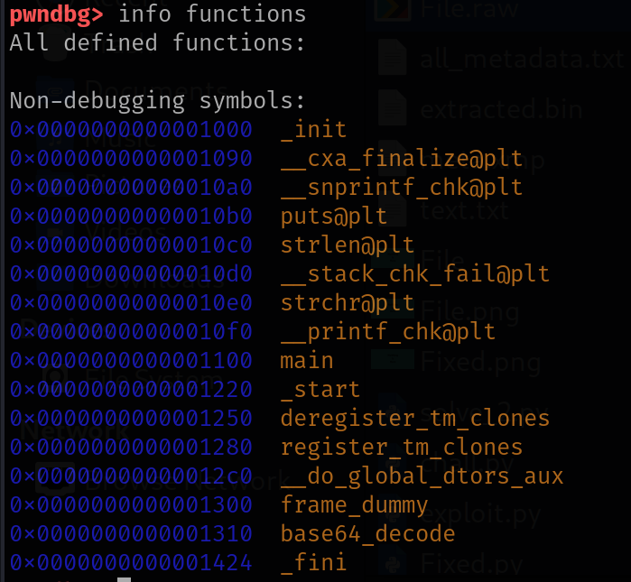
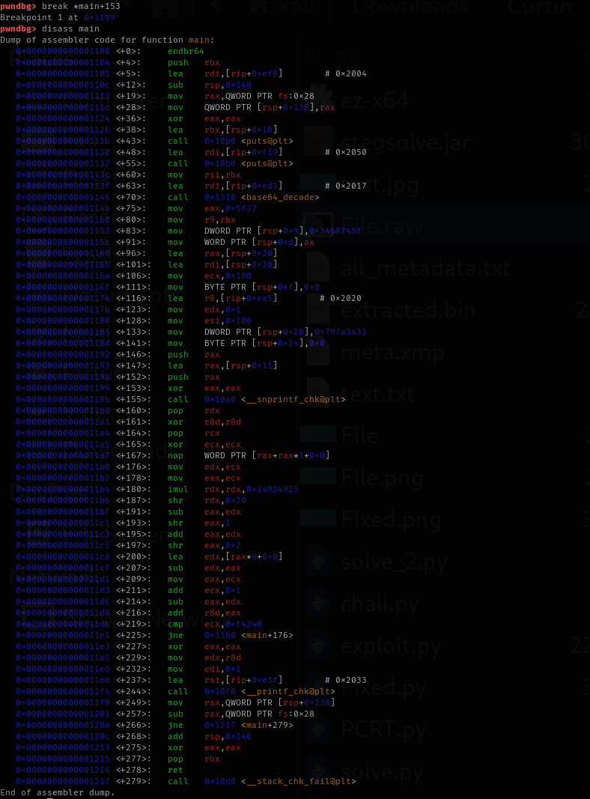
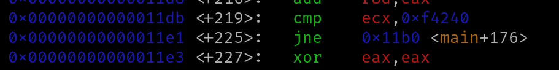
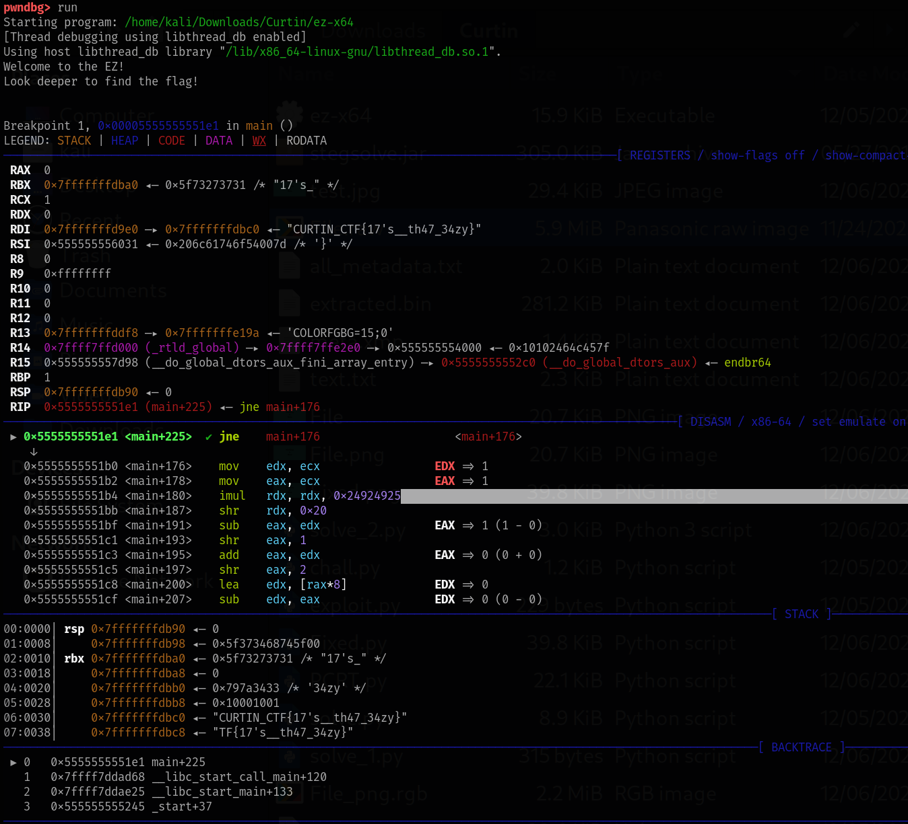

# Curtin 2025
- Date: December 6, 2025 → December 7, 2025

## EZ
- Challenge Name: EZ
- Category: Reverse Engineering


### Analysis
```bash
$ file ez-x64             
ez-x64: ELF 64-bit LSB pie executable, x86-64, version 1 (SYSV), dynamically linked, interpreter /lib64/ld-linux-x86-64.so.2, BuildID[sha1]=383e931d457fc2794c5740de7d79a60552d45f1a, for GNU/Linux 3.2.0, not stripped
```
Good news - it's not stripped, which means we'll have function names available.
```bash
$ chmod +x ez-x64 
```

```bash
$ ./ez-x64 
Welcome to the EZ!
Look deeper to find the flag!

Total iterations: 2999997
```
The message "Look deeper to find the flag!" is a hint - the program constructs the flag but never prints it. Instead, it shows us a distracting calculation result. To understand what the program is actually doing, we move to GDB with pwndbg:

```bash
$ gdb ez-x64
pwndbg> info functions
```

From the function list, we can already see main.

Next, disassemble main:
```bash
pwndbg> disass main
```


Looking at the disassembly, we can see several interesting things:
- The program prints "Welcome to the EZ!" and "Look deeper to find the flag!"
- It calls base64_decode with some string
- It constructs additional strings on the stack
- It uses snprintf (likely to format the flag)
- It runs a loop that calculates something (the 2,999,997 iterations we saw)

### Flag Retrieval Steps

From the disassembly, we identify a JNE instruction that controls the loop. We set a breakpoint after the flag construction but before the loop starts:
```bash
pwndbg> break *main+225
Breakpoint 1 at 0x11e1
```

Then run the program:
```bash
pwndbg> run
```


Result:
Now, inspect the memory location that holds the constructed string:
```bash
pwndbg> x/s 0x7fffffffdbc0
0x7fffffffdbc0: "CURTIN_CTF{17's__th47_34zy}"
```

